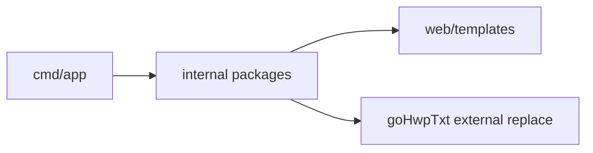

# AGENTS.md

## Project Context
- DocSearcher is a Go 1.24.3 document searcher for indexing HWP/HWPX/PDF files and searching them through a web UI.
- The root module is `hwp-searcher`; the local `goHwpTxt` module is replaced from `./goHwpTxt`.

## Commands
```bash
go mod download
go run ./cmd/app
go test ./...
go test $(go list ./... | grep -v '/cmd/client$')
go build ./cmd/app
```
- Run Windows WebView client on Windows: `go run ./cmd/client`
- Test local HWP parser module only when explicitly touching that dependency: `cd goHwpTxt && go test ./...`
- Pre-commit checks live in `.githooks/pre-commit`; enable them with `git config core.hooksPath .githooks`.
- On macOS, `go test ./...` currently fails in `cmd/client` because the Windows WebView client does not build there; the pre-commit hook excludes `cmd/client` and tests the remaining root packages plus `goHwpTxt`.

## Navigation
- `cmd/app` - search server entrypoint.
- `cmd/client` - Windows WebView client entrypoint.
- `internal/usecase` - indexing/search/watch-path use cases and indexing run orchestration.
- `internal/infra/scanner` - supported document file walking.
- `internal/infra/worker` - worker pool execution.
- `internal/infra/parser` - HWP/PDF text extraction.
- `internal/infra/search` - Bleve search engine.
- `goHwpTxt` - local HWP/HWPX parser module.

## Dependencies
- See [ARCHITECTURE.md](ARCHITECTURE.md) for the runtime flow and dependency map.
- See [cmd/AGENTS.md](cmd/AGENTS.md) and [internal/AGENTS.md](internal/AGENTS.md) before editing those modules.
- `internal/infra/parser` calls `goHwpTxt`; treat `goHwpTxt` as an external local replacement unless the task explicitly targets it.



## Go Style
- Follow the canonical Google Go Style Guide: https://google.github.io/styleguide/go/guide
- Prioritize clarity, simplicity, concision, maintainability, then consistency when choosing between valid Go implementations.
- Run `gofmt` on touched Go files; use `MixedCaps` or `mixedCaps` names instead of snake_case for Go identifiers.
- Prefer standard language constructs and standard library tools before adding new abstractions or dependencies.
- Keep comments focused on why code exists or why a non-obvious choice is necessary; avoid comments that restate the code.
- Do not make broad style-only rewrites just to chase guide differences. Apply the guide to new code and nearby touched code.
- When the guide does not decide a style question, follow the local package/file style unless doing so would spread an existing deviation or make the code harder to read.

## Git Conventions
- Use Conventional Commits for commit messages: `<type>(<scope>): <subject>`.
- Use the same `type` and `scope` in branch names: `<type>/<scope>-<short-subject>`.
- Write commit message subjects in Korean.
- Keep `<subject>` imperative and concise.
- Keep branch `<short-subject>` lowercase ASCII with hyphens.
- Prefer these types: `feat`, `fix`, `docs`, `test`, `refactor`, `chore`, `ci`, `build`.
- Scope should name the affected module or concern, such as `parser`, `indexer`, `search`, `server`, `client`, `docs`, or `codex`.
- Before creating or renaming a branch, verify the name matches `<type>/<scope>-<short-subject>`; if a requested name does not match, convert it to the closest conforming name.
- Examples:
  - Commit: `docs(codex): git 컨벤션 추가`
  - Branch: `docs/codex-add-git-conventions`
  - Commit: `fix(parser): 빈 pdf 텍스트 처리`
  - Branch: `fix/parser-handle-empty-pdf-text`

## Pull Request Conventions
- Use the PR title format `<type>(<scope>): <subject>`.
- Reuse the branch and commit `type` and `scope` in the PR title.
- Write PR titles in Korean, using an imperative, concise `<subject>`.
- Write PR descriptions in Korean and keep them concise.
- Include these items in the PR description:
  - Summary of the user-visible or agent-facing change.
  - Verification commands run, or the exact reason verification was skipped.
  - Any known follow-up work, risk, or platform-specific limitation.
- When creating a PR for documentation-only changes, mention in Korean that Go tests were not run because no Go code changed.
- Use draft PRs only when follow-up review, additional validation, or unfinished work remains.

## Change Boundaries
- Do not commit local runtime data: `config.json`, `hwp-index.bleve/`, or real test documents under `goHwpTxt/testdata/`.
- Treat `goHwpTxt/pkg/hwp3/hnc2unicode_tables.go` as table data; avoid broad formatting-only edits there.
- Note: `config.example.json` is the committed configuration contract; keep local machine paths only in ignored `config.json`.
- Warning: never commit secrets, private keys, certificate bundles, or `.env*` files. Add placeholder examples instead.
- Warning: destructive commands must not target user document folders. Index reset/recovery code should only remove known runtime index paths such as `hwp-index.bleve/`.
- Important: preserve unrelated dirty worktree changes. Do not use `git reset --hard` or `git checkout --` unless explicitly requested.

## Working Rules
- When asked to "PR 올려" or "올려", create the pull request after pushing the branch; do not stop at reporting the PR creation URL.

## Done Criteria
- For Go code changes, run `go test ./...` unless the current platform cannot build `cmd/client`.
- On macOS/Linux, use `go test $(go list ./... | grep -v '/cmd/client$')` and report that `cmd/client` is Windows-only.
- For parser changes that touch `goHwpTxt`, also run `cd goHwpTxt && go test ./...`.
- For documentation-only changes, Go tests may be skipped; report that no Go code changed.
- If any check cannot be run, report the exact command, reason, and residual risk.
