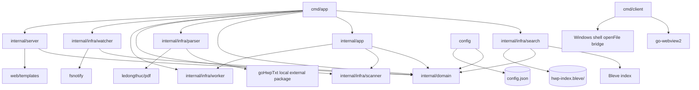

# DocSearcher Architecture

DocSearcher is a Go desktop/web document searcher. The root module is
`hwp-searcher`; `goHwpTxt` is consumed through `replace goHwpTxt => ./goHwpTxt`
and should be treated as a local external package boundary, not as core app
code for Codex-readiness ownership.

## Entrypoints

- `cmd/app`: starts the search server. It initializes the Bleve index at
  `hwp-index.bleve`, wires app use cases to parser/search/config/watcher
  adapters, starts filesystem watching, then serves HTTP on port `8080`.
- `cmd/client`: Windows WebView2 shell. It reads `server.txt` next to the
  executable, opens the server URL, and exposes `openFile` to JavaScript through
  `cmd /c start`.

## Runtime Flow

1. `cmd/app/main.go` constructs `search.NewEngine("hwp-index.bleve")`.
2. `cmd/app/main.go` wires the shared search engine and other concrete
   adapters to small `internal/app`
   use cases: `Indexer`, `Searcher`, `WatchPaths`, and `Stats`.
3. `cmd/app/main.go` wires `app.IndexRunner`, `watcher.Registry`, and
   `server.Handlers`; internal packages receive dependencies instead of
   constructing parser/search/config implementations themselves.
4. `watcher.Start()` starts fsnotify handling. `app.WatchPaths.Start()` loads
   `config.json`, recursively watches configured folders through the injected
   registry, and triggers initial indexing for each watched path.
5. `server.Start("8080", handlers)` registers HTML/HTMX endpoints:
   `/`, `/api/search`, `/api/config`, `/api/watch`, `/api/stats`, and
   `/api/index/reset`.
6. Adding a watched path through `/api/watch` calls `app.WatchPaths`, which
   persists `config.json`, starts recursive watching, and starts indexing.
7. `app.IndexRunner.Start` uses `internal/infra/scanner` to walk paths accepted by
   `domain.IsSupportedDocumentPath`, then sends them to `internal/infra/worker` for
   parallel processing. Each path is processed through `app.Indexer.IndexFile`.
8. `app.Searcher` converts UI flags into `domain.SearchRequest`; `search.Engine`
   runs exact, no-space, or query-string searches and returns highlighted
   results to the web UI.

## Module Responsibilities

- `internal/infra/config`: owns persistent user configuration in `config.json`.
- `internal/infra/watcher`: owns fsnotify setup, recursive watch registration, and
  file create/write/remove reactions. File indexing/deletion behavior is
  injected through `watcher.FileHandler`; initial scans are injected through
  `watcher.Registry.StartIndexing`.
- `internal/app`: owns small use-case types and consumer-side ports:
  `Indexer`, `IndexRunner`, `Searcher`, `WatchPaths`, and `Stats`.
- `internal/domain`: owns core document/search/watch-path value types,
  supported document path policy, and normalization rules shared by use cases
  and adapters.
- `internal/infra/scanner`: owns walking supported document file paths.
- `internal/infra/worker`: owns worker pool execution for path processors.
- `internal/infra/parser`: owns file-extension dispatch and text extraction. It calls
  `goHwpTxt.ExtractText` for `.hwp`/`.hwpx` and `github.com/ledongthuc/pdf` for
  `.pdf`. See `docs/parser-boundary.md` for the parser-facing contract and
  fixture expectations.
- `internal/infra/search`: adapts `app` document/search/count/reset ports to an
  instance-owned Bleve index, mapping, indexing, querying, counting, deletion,
  and reset.
- `internal/server`: owns HTTP routes, template rendering, and HTMX fragments.
  Search/config/reset workflows are delegated to injected interfaces.
- `web/templates`: owns the browser UI consumed by `internal/server`.
- `goHwpTxt`: local replacement for an external HWP/HWPX parser package. Prefer
  treating changes here as dependency updates unless the task explicitly targets
  parser internals.

## Dependency Map

## Runtime Data And Change Boundaries

- `config.json` is local runtime configuration and must not be committed.
- `hwp-index.bleve/` is generated Bleve index data and must not be committed.
- Real user documents and real parser fixtures under `goHwpTxt/testdata/` must
  not be committed.
- `goHwpTxt/pkg/hwp3/hnc2unicode_tables.go` is table data. Avoid broad
  formatting-only edits.
- The core application boundary is `cmd`, `internal`, and `web`. `goHwpTxt` is
  reachable from this repository for local builds, but it should remain a
  dependency boundary in architecture and Codex-readiness analysis.

## Codex Change Guidance

- Server/search behavior changes usually cross `internal/server`,
  `internal/app`, `internal/infra/search`, and `web/templates`; verify with targeted
  search/indexing flows.
- Parser behavior changes should start in `internal/infra/parser` unless the task
  explicitly requires changing the local `goHwpTxt` dependency.
- Indexing and watcher changes are concurrency-sensitive. Check
  `app.Indexer`, `app.IndexRunner`, `app.WatchPaths`, `internal/infra/scanner`,
  `internal/infra/worker`, and fsnotify event handling before changing startup or
  reset flows.
- For Go code changes, run `go test ./...`; on macOS the Windows WebView client
  may not build, so use `go test $(go list ./... | grep -v '/cmd/client$')`
  when that platform limitation applies.
