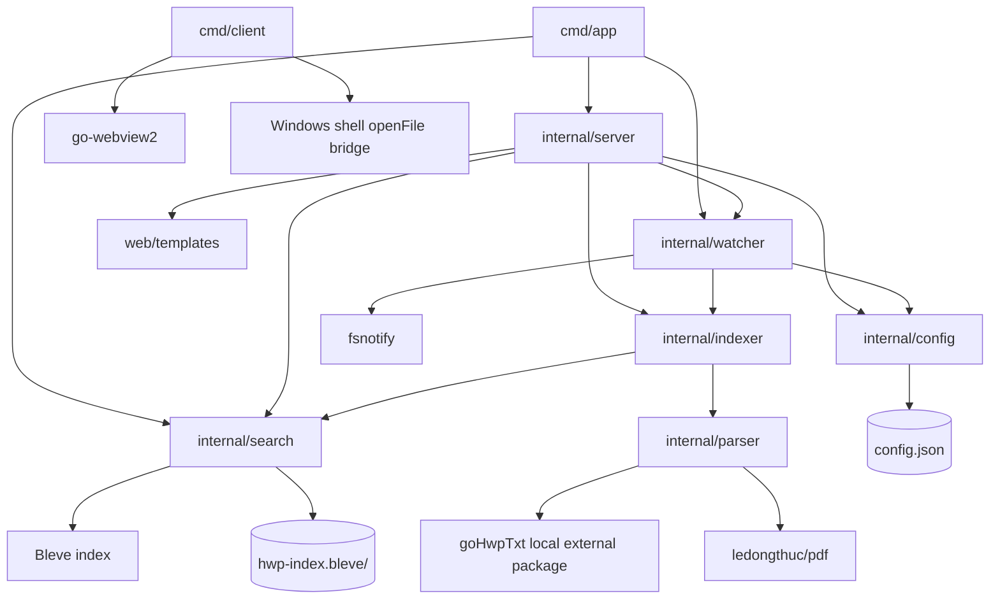

# DocSearcher Architecture

DocSearcher is a Go desktop/web document searcher. The root module is
`hwp-searcher`; `goHwpTxt` is consumed through `replace goHwpTxt => ./goHwpTxt`
and should be treated as a local external package boundary, not as core app
code for Codex-readiness ownership.

## Entrypoints

- `cmd/app`: starts the search server. It initializes the Bleve index at
  `hwp-index.bleve`, starts filesystem watching, then serves HTTP on port
  `8080`.
- `cmd/client`: Windows WebView2 shell. It reads `server.txt` next to the
  executable, opens the server URL, and exposes `openFile` to JavaScript through
  `cmd /c start`.

## Runtime Flow

1. `cmd/app/main.go` calls `search.Init("hwp-index.bleve")`.
2. `watcher.Start()` loads `config.json`, recursively watches configured
   folders, and triggers initial indexing for each watched path.
3. `server.Start("8080")` registers HTML/HTMX endpoints:
   `/`, `/api/search`, `/api/config`, `/api/watch`, `/api/stats`, and
   `/api/index/reset`.
4. Adding a watched path through `/api/watch` updates `config.Current`, persists
   `config.json`, starts recursive watching, and starts indexing.
5. `indexer.Start` walks files and sends `.hwp` and `.pdf` paths to four worker
   goroutines. `indexer.IndexFile` parses text, builds a no-space variant, and
   writes both fields to Bleve.
6. `search.Search` runs exact, no-space, or query-string searches and returns
   highlighted results to the web UI.

## Module Responsibilities

- `internal/config`: owns persistent user configuration in `config.json`.
- `internal/watcher`: owns fsnotify setup, recursive watch registration, and
  file create/write/remove reactions.
- `internal/indexer`: owns file walking, worker concurrency, parse orchestration,
  no-space content normalization, and document deletion from the index.
- `internal/parser`: owns file-extension dispatch and text extraction. It calls
  `goHwpTxt.ExtractText` for `.hwp`/`.hwpx` and `github.com/ledongthuc/pdf` for
  `.pdf`. See `docs/parser-boundary.md` for the parser-facing contract and
  fixture expectations.
- `internal/search`: owns the process-global Bleve index, mapping, indexing,
  querying, counting, deletion, and reset.
- `internal/server`: owns HTTP routes, template rendering, HTMX fragments, and
  user-facing search/config/reset workflows.
- `web/templates`: owns the browser UI consumed by `internal/server`.
- `goHwpTxt`: local replacement for an external HWP/HWPX parser package. Prefer
  treating changes here as dependency updates unless the task explicitly targets
  parser internals.

## Dependency Map

## Runtime Data And Change Boundaries

- `config.json` is local runtime configuration and must not be committed.
- `hwp-index.bleve/` is generated Bleve index data and must not be committed.
- Real user documents and real parser fixtures under `goHwpTxt/testdata/` must
  not be committed.
- `goHwpTxt/pkg/hwp3/hnc2unicode_tables.go` is table data. Avoid broad
  formatting-only edits.
- The core application boundary is `cmd`, `internal`, and `web`. `goHwpTxt` is
  reachable from this repository for local builds, but it should remain a
  dependency boundary in architecture and Codex-readiness analysis.

## Codex Change Guidance

- Server/search behavior changes usually cross `internal/server`,
  `internal/search`, and `web/templates`; verify with targeted search/indexing
  flows.
- Parser behavior changes should start in `internal/parser` unless the task
  explicitly requires changing the local `goHwpTxt` dependency.
- Indexing and watcher changes are concurrency-sensitive. Check
  `indexer.IsIndexing`, worker lifecycle, and fsnotify event handling before
  changing startup or reset flows.
- For Go code changes, run `go test ./...`; on macOS the Windows WebView client
  may not build, so use `go test $(go list ./... | grep -v '/cmd/client$')`
  when that platform limitation applies.
